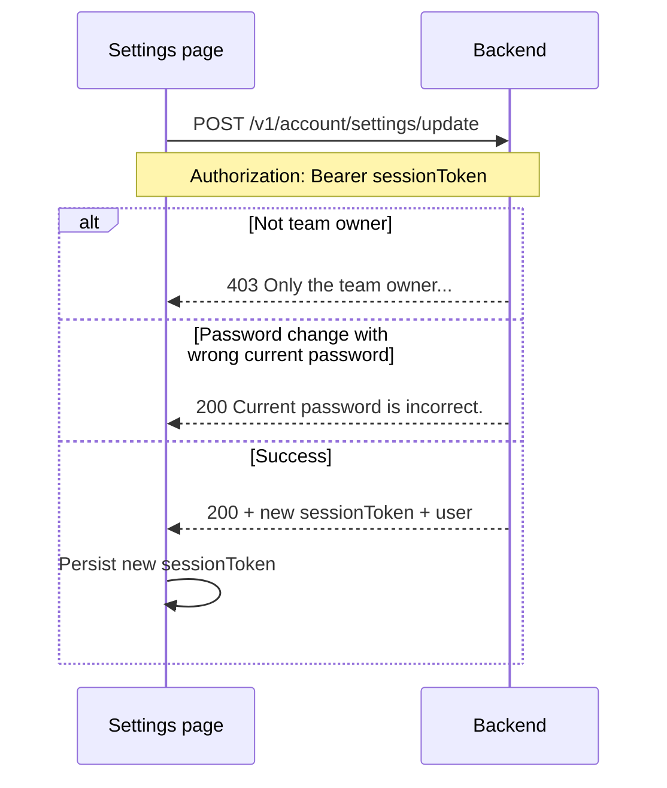

# Elysium Atlas — Account Settings API

Technical reference for updating the **team owner's** account settings: profile name, owned team name, and password.

**Base URL:** `{SERVER_URL}/elysium-atlas`

**Example:** `http://localhost:3000/elysium-atlas`

---

## Overview

This endpoint lets the **owner of the active session team** update:

| Field | Scope | Notes |
|-------|--------|--------|
| `first_name` | User (`elysium_atlas_users`) | Partial update supported |
| `last_name` | User | Partial update supported |
| `team_name` | Team (`atlas_teams`) | Updates the session `team_id` team |
| `password` | User | Requires correct `current_password` |

You may send **one field or several** in a single request. Omitted fields are left unchanged.

---

## Authentication

Requires the standard Atlas **session token** from login.

```http
POST /elysium-atlas/v1/account/settings/update
Authorization: Bearer <sessionToken>
Content-Type: application/json
```

### Owner-only access

The backend reads `user_id` and `team_id` from the JWT and verifies:

1. The team exists and is active.
2. The caller's role for that `team_id` is **`owner`**.
3. `atlas_teams.owner_user_id` matches the JWT `user_id`.

If the session team is one the user joined as **admin** or **member**, the request is rejected with **403**.

---

## Request

### Endpoint

`POST /v1/account/settings/update`

### Body (all fields optional — send only what you want to change)

```json
{
  "first_name": "Jane",
  "last_name": "Doe",
  "team_name": "Jane's Workspace",
  "current_password": "oldPassword123",
  "password": "newSecurePassword456"
}
```

| Field | Type | Required when |
|-------|------|----------------|
| `first_name` | string | — (if sent, must be non-empty after trim) |
| `last_name` | string | — (if sent, must be non-empty after trim) |
| `team_name` | string | — (if sent, must be non-empty after trim) |
| `current_password` | string | **Required** whenever `password` is sent |
| `password` | string | **Required** whenever `current_password` is sent |

### Partial update examples

**Name only:**

```json
{ "first_name": "Jane", "last_name": "Smith" }
```

**Team name only:**

```json
{ "team_name": "Acme Design Studio" }
```

**Password only:**

```json
{
  "current_password": "oldPassword123",
  "password": "newSecurePassword456"
}
```

---

## Success response

**HTTP 200**

```json
{
  "success": true,
  "message": "Account settings updated successfully.",
  "sessionToken": "<new-jwt>",
  "user": {
    "user_id": "69568df774db787c7f93b86b",
    "email": "owner@example.com",
    "first_name": "Jane",
    "last_name": "Doe",
    "profile_image_url": null,
    "team_id": "699e9bf195fcec2ed8ef6763",
    "team_name": "Jane's Workspace",
    "role": "owner"
  }
}
```

Replace the stored session token with the returned `sessionToken` so JWT claims (`first_name`, `last_name`, etc.) stay in sync.

---

## Error responses

| HTTP | `success` | `message` |
|------|-----------|-----------|
| `401` | `false` | No token provided. |
| `401` | `false` | Invalid or expired token. |
| `400` | `false` | Team ID is missing from session. |
| `403` | `false` | Team not found or inactive. |
| `403` | `false` | You are not a member of this team. |
| `403` | `false` | Only the team owner can update account settings. |
| `200` | `false` | No valid fields to update. |
| `200` | `false` | first_name cannot be empty. |
| `200` | `false` | last_name cannot be empty. |
| `200` | `false` | team_name cannot be empty. |
| `200` | `false` | current_password is required to change your password. |
| `200` | `false` | password is required when changing your password. |
| `200` | `false` | Current password is incorrect. |
| `404` | `false` | User not found. |
| `404` | `false` | Team not found. |
| `500` | `false` | Server error. |

---

## Frontend flow



### UI notes

1. Show account settings only when `role === "owner"` for the active team (or handle 403 gracefully).
2. On password change, always collect **current** and **new** password.
3. After any successful update, swap in the new `sessionToken` from the response.

---

## Related

| Document | Purpose |
|----------|---------|
| [frontend-auth-guide.md](./frontend-auth-guide.md) | Login and session JWT |
| [backend-team-rbac-guide.md](./backend-team-rbac-guide.md) | Owner vs admin vs member roles |
| [atlas-auth-api.md](./atlas-auth-api.md) | Auth endpoints (includes legacy `POST /v1/auth/profile/update`) |

> **Note:** `POST /v1/auth/profile/update` still exists for profile completion flows but does **not** enforce owner-only access or current-password verification. Prefer this account settings endpoint for the owner settings page.

---

## Testing checklist

- [ ] Owner can update `first_name` alone
- [ ] Owner can update `last_name` alone
- [ ] Owner can update `team_name` alone
- [ ] Owner can update name + team name together
- [ ] Password change succeeds with correct `current_password`
- [ ] Password change fails with wrong `current_password`
- [ ] Password change fails when `current_password` is omitted
- [ ] Admin/member session on same team gets **403**
- [ ] Session without `team_id` gets **400**
- [ ] Empty string for any sent field returns validation error
- [ ] Response includes fresh `sessionToken` with updated names
