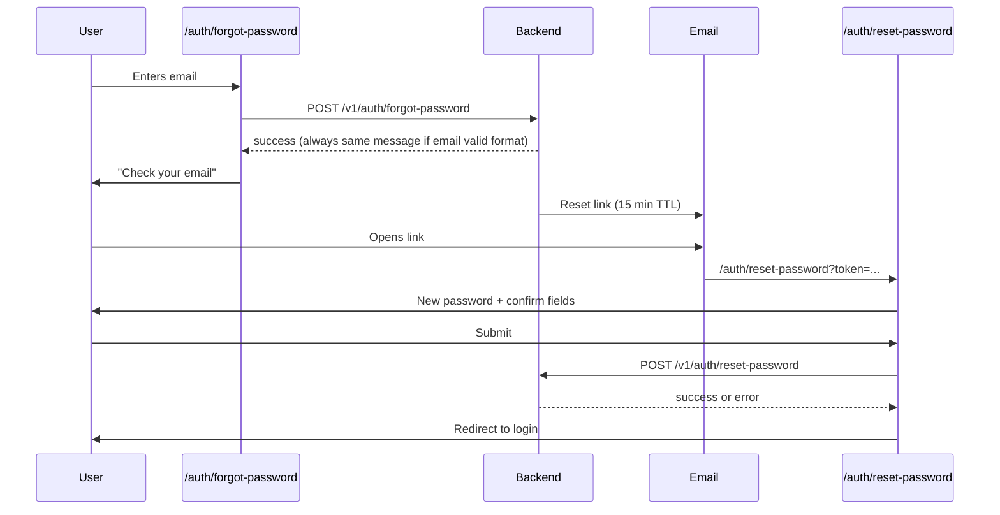

# Elysium Atlas — Auth API (short reference)

> **Frontend integration:** use the full guide → [**frontend-auth-guide.md**](./frontend-auth-guide.md)

**Base URL:** `{SERVER_URL}/elysium-atlas`

**Example:** `http://localhost:3001/elysium-atlas`

---

## Login endpoints

| Endpoint | Purpose |
|----------|---------|
| `POST /v1/auth/magic-link` | Password login or send magic link email |
| `POST /v1/auth/verify` | Verify magic link token |
| `POST /v1/auth/verify-google-login` | Google OAuth login |
| `POST /v1/auth/select-team` | **Phase 2** — pick team when `requires_team_selection: true` |
| `POST /v1/auth/decode-token` | **Internal** — decode JWT (`Authorization: APPLICATION_SECRET_KEY`) |
| `POST /v1/auth/profile/update` | Update profile (legacy — no owner/password checks) |
| `POST /v1/account/settings/update` | **Owner** account settings (name, team name, password) |
| `POST /v1/auth/forgot-password` | Request password reset email |
| `POST /v1/auth/reset-password` | Set new password using reset token |

---

## Team selection rule

- `teams.length <= 1` → immediate `sessionToken` (includes `role`)
- `teams.length > 1` → `requires_team_selection: true` + `selection_token` (no session yet)

Session JWT includes `role`: `"owner"` | `"admin"` | `"member"` for the active team.

See [frontend-auth-guide.md](./frontend-auth-guide.md) for full login flows and JSON examples.

---

## Forgot password flow (frontend)

Two new **public** pages (no login required):

| Route | Purpose |
|-------|---------|
| `/auth/forgot-password` | User enters email → call forgot-password API |
| `/auth/reset-password?token={jwt}` | Landing page from email → user sets new password |



### Link from login page

Add a **"Forgot password?"** link on the password login form → `/auth/forgot-password`.

---

## API — Forgot password

**`POST /v1/auth/forgot-password`**

No `Authorization` header.

### Request

```json
{
  "email": "user@example.com"
}
```

### Success — `200`

```json
{
  "success": true,
  "message": "If an account exists with this email, a password reset link has been sent."
}
```

The API always returns this message when the email format is valid — even if no account exists — so attackers cannot discover registered emails.

An email is **only sent** when:

- A user exists with that email, and
- `is_profile_complete` is `true` (registered / active account with a completed profile)

### Email content

Same visual style as the magic-link email. Button label: **Reset password**.

Link format:

```
{ATLAS_FRONTEND_BASE_URL}/auth/reset-password?token={jwt}
```

Reset token JWT payload:

```json
{
  "type": "atlas_password_reset",
  "user_id": "69568df774db787c7f93b86b",
  "email": "user@example.com",
  "iat": 1781374961,
  "exp": 1781375861
}
```

**TTL:** 15 minutes.

### Failures — `200`

```json
{ "success": false, "message": "A valid email is required." }
```

---

## API — Reset password

**`POST /v1/auth/reset-password`**

No `Authorization` header.

### Request

```json
{
  "token": "eyJhbGciOiJIUzI1NiIs...",
  "password": "newSecurePassword123"
}
```

`token` may also be passed as a query param when using `GET`-style debugging, but the frontend should **POST** with JSON body.

### Success — `200`

```json
{
  "success": true,
  "message": "Password reset successfully. You can now log in with your new password."
}
```

No `sessionToken` is returned. Redirect the user to the login page and let them sign in with the new password.

### Failures

| HTTP | Response |
|------|----------|
| `400` | `{ "success": false, "message": "Token is required." }` |
| `200` | `{ "success": false, "message": "A valid password is required." }` |
| `200` | `{ "success": false, "message": "Invalid or expired reset link." }` |

If the token is expired, show the error and offer a link back to `/auth/forgot-password`.

---

## Frontend checklist

### `/auth/forgot-password`

- [ ] Email input + submit button
- [ ] `POST /elysium-atlas/v1/auth/forgot-password` with `{ email }`
- [ ] On `success: true`, show "Check your email" (do not imply whether the email is registered)
- [ ] Link back to login

### `/auth/reset-password`

- [ ] Read `token` from URL query (`?token=...`)
- [ ] If `token` missing → show error + link to forgot-password
- [ ] New password + confirm password fields (confirm is client-side only)
- [ ] `POST /elysium-atlas/v1/auth/reset-password` with `{ token, password }`
- [ ] On success → redirect to login with success toast
- [ ] On `Invalid or expired reset link` → link to `/auth/forgot-password`

### Login page

- [ ] Add "Forgot password?" → `/auth/forgot-password`

---

## Example fetch calls

```javascript
const BASE = "http://localhost:3001/elysium-atlas";

// Step 1 — request reset email
await fetch(`${BASE}/v1/auth/forgot-password`, {
  method: "POST",
  headers: { "Content-Type": "application/json" },
  body: JSON.stringify({ email: "user@example.com" }),
});

// Step 2 — set new password (on reset page)
const token = new URLSearchParams(window.location.search).get("token");

await fetch(`${BASE}/v1/auth/reset-password`, {
  method: "POST",
  headers: { "Content-Type": "application/json" },
  body: JSON.stringify({
    token,
    password: "newSecurePassword123",
  }),
});
```

---

## Related docs

| Document | Purpose |
|----------|---------|
| [frontend-auth-guide.md](./frontend-auth-guide.md) | Full login integration |
| [account-settings-md.md](./account-settings-md.md) | Owner changes password while logged in (requires `current_password`) |

**Logged-in password change** (owner settings) uses `POST /v1/account/settings/update` with `current_password` + `password`. **Forgot password** is for users who cannot log in.
