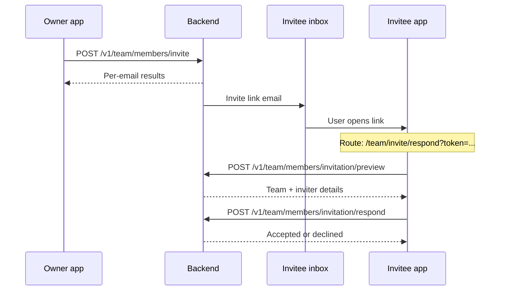

# Elysium Atlas — Team Members API

Technical reference for frontend integration of team member invitations and membership management.

**Base URL:** `{SERVER_URL}/elysium-atlas`

**Example:** `http://localhost:3000/elysium-atlas`

---

## Table of contents

1. [Overview](#overview)
2. [Authentication](#authentication)
3. [Frontend flow](#frontend-flow)
4. [API endpoints](#api-endpoints)
5. [MongoDB collections](#mongodb-collections)
6. [Invitation token (JWT)](#invitation-token-jwt)
7. [Per-email invite statuses](#per-email-invite-statuses)
8. [Error handling](#error-handling)
9. [Plan limits & capacity](#plan-limits--capacity)
10. [Testing checklist](#testing-checklist)

---

## Overview

Team owners invite registered Atlas users (with completed profiles) to join their team. The system:

1. Validates each email against `elysium_atlas_users`
2. Creates or refreshes a pending invitation in `atlas_team_invitations`
3. Sends a signed JWT invite link by email (7-day TTL)
4. Lets the invitee preview and accept/decline via token-only APIs (no login required)
5. Persists accepted members in `atlas_team_members` (one document per member — scalable to thousands)

User profile fields (`first_name`, `last_name`, `profile_image_url`) are **never stored** on membership documents. They are always read from `elysium_atlas_users` at response time.

---

## Authentication

### Team-scoped endpoints (invite, list, remove members)

Requires the standard Atlas **session token** from login. All checks use the session's **`team_id`** and the caller's **role** for that team — not whether they are the team owner.

```http
Authorization: Bearer <sessionToken>
Content-Type: application/json
```

The session JWT payload includes:

| Claim | Description |
|-------|-------------|
| `user_id` | Caller's MongoDB user id |
| `email` | Caller's email |
| `team_id` | **Active team** context (used for all team member APIs) |
| `role` | Caller's role for `team_id`: `"owner"` \| `"admin"` \| `"member"` |
| `first_name`, `last_name` | Profile fields |
| `is_profile_complete` | Must be `true` for login |

### Role permissions

| Action | `owner` | `admin` | `member` |
|--------|---------|---------|----------|
| List members (`GET /team/members`) | Yes | Yes | Yes |
| Invite members (`POST /team/members/invite`) | Yes | Yes | No → `403` |
| Remove members (`POST /team/members/remove`) | Yes | Yes | No → `403` |

The backend re-resolves role from the database on each request (via `team_id` + `user_id`), not only from the JWT claim.

### Public invitee endpoints (preview, respond)

**No `Authorization` header required.** The invite JWT in the request body is the credential.

---

## Frontend flow



### Suggested frontend routes

| Route | Purpose |
|-------|---------|
| `/team/invite/respond?token={jwt}` | Landing page from email; read `token` from query string |

### Suggested UI steps on invite landing page

1. Read `token` from URL query (`?token=...`)
2. Call **preview** API to show team name, inviter name, expiry
3. Show **Accept** / **Decline** buttons
4. Call **respond** API with `{ token, accept: true }` or `{ token, accept: false }`
5. Show success or error state

---

## API endpoints

### 1. Invite team members

**`POST /elysium-atlas/v1/team/members/invite`**

Batch-invite up to **50** emails per request.

#### Headers

```json
{
  "Authorization": "Bearer <sessionToken>",
  "Content-Type": "application/json"
}
```

#### Request body

```json
{
  "emails": [
    "alice@example.com",
    "bob@example.com",
    "unknown@example.com"
  ],
  "role": "member"
}
```

| Field | Required | Type | Notes |
|-------|----------|------|-------|
| `emails` | Yes | `string[]` | 1–50 unique emails (duplicates in the same request are reported as `duplicate_in_request`) |
| `role` | No | `string` | Default `"member"`. `"admin"` or `"member"` |

#### Success response — `200`

```json
{
  "success": true,
  "message": "Invitation batch processed.",
  "team_id": "665a1b2c3d4e5f6789012345",
  "summary": {
    "total": 3,
    "processed": 1,
    "skipped": 2
  },
  "results": [
    {
      "email": "alice@example.com",
      "status": "invited",
      "email_resent": false,
      "invitation_id": "665a1b2c3d4e5f6789012346",
      "user_id": "665a1b2c3d4e5f6789012347",
      "expires_at": "2026-06-12T10:00:00.000Z"
    },
    {
      "email": "bob@example.com",
      "status": "already_invited",
      "email_resent": true,
      "invitation_id": "665a1b2c3d4e5f6789012348",
      "user_id": "665a1b2c3d4e5f6789012349",
      "expires_at": "2026-06-12T10:00:00.000Z"
    },
    {
      "email": "unknown@example.com",
      "status": "not_registered"
    }
  ]
}
```

#### Error responses

| HTTP | Body |
|------|------|
| `401` | `{ "success": false, "message": "No token provided." }` |
| `401` | `{ "success": false, "message": "Invalid or expired token." }` |
| `400` | `{ "success": false, "message": "At least one email is required." }` |
| `400` | `{ "success": false, "message": "You can invite up to 50 emails per request." }` |
| `400` | `{ "success": false, "message": "Invalid role. Must be \"admin\" or \"member\"." }` |
| `400` | `{ "success": false, "message": "Team ID is missing from session." }` |
| `403` | `{ "success": false, "message": "You do not have permission to invite members to this team." }` |
| `403` | `{ "success": false, "message": "You are not a member of this team." }` |

---

### 2. Preview invitation

**`POST /elysium-atlas/v1/team/members/invitation/preview`**

Load invitation details for the invite landing page. Token-only; no session required.

#### Headers

```json
{
  "Content-Type": "application/json"
}
```

#### Request body

```json
{
  "token": "<inviteJwtFromEmailLink>"
}
```

#### Success response — `200`

```json
{
  "success": true,
  "invitation": {
    "invitation_id": "665a1b2c3d4e5f6789012346",
    "team_id": "665a1b2c3d4e5f6789012345",
    "team_name": "Acme Workspace",
    "inviter": {
      "user_id": "665a1b2c3d4e5f6789012300",
      "email": "owner@example.com",
      "first_name": "Jane",
      "last_name": "Doe"
    },
    "invitee": {
      "user_id": "665a1b2c3d4e5f6789012347",
      "email": "alice@example.com",
      "first_name": "Alice",
      "last_name": "Smith"
    },
    "role": "member",
    "expires_at": "2026-06-12T10:00:00.000Z",
    "status": "pending"
  }
}
```

#### Failure response — `200`

```json
{
  "success": false,
  "message": "Invalid or expired invitation."
}
```

```json
{
  "success": false,
  "message": "This invitation is no longer available.",
  "invitation_status": "accepted"
}
```

#### Error response — `400`

```json
{
  "success": false,
  "message": "Token is required."
}
```

---

### 3. Respond to invitation

**`POST /elysium-atlas/v1/team/members/invitation/respond`**

Accept or decline an invitation. Token-only; no session required.

#### Headers

```json
{
  "Content-Type": "application/json"
}
```

#### Request body — accept

```json
{
  "token": "<inviteJwtFromEmailLink>",
  "accept": true
}
```

#### Request body — decline

```json
{
  "token": "<inviteJwtFromEmailLink>",
  "accept": false
}
```

| Field | Required | Type | Notes |
|-------|----------|------|-------|
| `token` | Yes | `string` | Invite JWT from email link |
| `accept` | Yes | `boolean` | `true` to join, `false` to decline |

#### Success — accepted — `200`

```json
{
  "success": true,
  "message": "You have joined the team.",
  "membership": {
    "team_id": "665a1b2c3d4e5f6789012345",
    "team_name": "Acme Workspace",
    "role": "member",
    "joined_at": "2026-06-05T12:00:00.000Z"
  }
}
```

#### Success — declined — `200`

```json
{
  "success": true,
  "message": "Invitation declined."
}
```

#### Success — already member (idempotent) — `200`

```json
{
  "success": true,
  "message": "You are already a member of this team.",
  "membership": {
    "team_id": "665a1b2c3d4e5f6789012345",
    "team_name": "Acme Workspace",
    "role": "member",
    "joined_at": "2026-06-01T08:00:00.000Z"
  }
}
```

#### Failure responses — `200`

```json
{
  "success": false,
  "message": "Invalid or expired invitation."
}
```

```json
{
  "success": false,
  "message": "Team is full."
}
```

```json
{
  "success": false,
  "message": "Your account is not eligible to join this team."
}
```

#### Error — `400`

```json
{
  "success": false,
  "message": "Token is required."
}
```

---

### 4. List team members

**`GET /elysium-atlas/v1/team/members`**

Paginated list of accepted team members. Owner-only. Profile names are joined from `elysium_atlas_users`.

#### Headers

```json
{
  "Authorization": "Bearer <owner_sessionToken>"
}
```

#### Query parameters

| Param | Default | Max | Description |
|-------|---------|-----|-------------|
| `page` | `1` | — | Page number (1-based) |
| `limit` | `50` | `100` | Items per page |
| `status` | `active` | — | Membership status filter |

**Example:** `GET /elysium-atlas/v1/team/members?page=1&limit=50&status=active`

#### Success response — `200`

```json
{
  "success": true,
  "team_id": "665a1b2c3d4e5f6789012345",
  "current_team_size": 5,
  "max_team_members": 55,
  "page": 1,
  "limit": 50,
  "total": 5,
  "members": [
    {
      "user_id": "665a1b2c3d4e5f6789012300",
      "email": "owner@example.com",
      "first_name": "Jane",
      "last_name": "Doe",
      "profile_image_url": null,
      "role": "owner",
      "status": "active",
      "joined_at": "2026-02-25T06:51:29.737Z"
    },
    {
      "user_id": "665a1b2c3d4e5f6789012347",
      "email": "alice@example.com",
      "first_name": "Alice",
      "last_name": "Smith",
      "profile_image_url": null,
      "role": "member",
      "status": "active",
      "joined_at": "2026-06-05T12:00:00.000Z"
    }
  ]
}
```

> **Note:** `current_team_size` and `max_team_members` come from `atlas_teams` (`member_count` / `max_members`), refreshed before each response. When `status=active`, `members[]` includes the **owner** first (`role: "owner"`), then invited members. `total` = owner + matching `atlas_team_members` rows.

#### Error — `403`

```json
{
  "success": false,
  "message": "You do not have permission to view members of this team."
}
```

---

### 5. Remove team member

**`POST /elysium-atlas/v1/team/members/remove`**

Owner-only. Soft-removes an active member (`status: "removed"`). No counter updates.

#### Headers

```json
{
  "Authorization": "Bearer <sessionToken>",
  "Content-Type": "application/json"
}
```

#### Request body

```json
{
  "user_id": "665a1b2c3d4e5f6789012347"
}
```

#### Success response — `200`

```json
{
  "success": true,
  "message": "Team member removed.",
  "member": {
    "user_id": "665a1b2c3d4e5f6789012347",
    "email": "alice@example.com",
    "role": "member",
    "status": "removed"
  }
}
```

#### Error responses

| HTTP | Body |
|------|------|
| `400` | `{ "success": false, "message": "user_id is required." }` |
| `400` | `{ "success": false, "message": "The team owner cannot be removed." }` |
| `401` | Missing or invalid session token |
| `403` | `{ "success": false, "message": "You do not have permission to remove members from this team." }` |
| `404` | `{ "success": false, "message": "This user is not a member of your team." }` |
| `200` | `{ "success": false, "message": "This member has already been removed.", "member": { ... } }` |

---

## MongoDB collections

### `atlas_teams` (existing)

Team metadata. One personal team per owner.

| Field | Purpose |
|-------|---------|
| `owner_user_id` | Team owner |
| `member_count` | Owner (1) + active members — **source of truth**, recomputed on team operations |
| `max_members` | Max team size — **source of truth** (set directly on `atlas_teams`; not overwritten by plan sync) |

Team capacity in `/plan/info` and invite/list APIs reads from **`atlas_teams`**, not from this collection.

### `atlas_user_available_plan_limits`

Per-user **consumable** limits remaining for the active plan period (e.g. `ai_queries`, `max_visitor_message_chars`).

```json
{
  "_id": "ObjectId",
  "user_id": "665a1b2c3d4e5f6789012300",
  "ai_queries": 4655,
  "max_visitor_message_chars": 4000,
  "createdAt": "2026-06-05T10:00:00.000Z",
  "updatedAt": "2026-06-13T22:48:53.037Z"
}
```

| Rule | Detail |
|------|--------|
| **Stored here** | Consumable limits only |
| **Not stored here** | `max_team_members` — use `atlas_teams.max_members` |
| **Legacy docs** | Old documents may still have `max_team_members`; removed on next plan sync (`$unset`) and never returned in `/plan/info` → `available_limits` |
| **Written by** | `syncUserAvailableLimits` (trial provisioning, `/plan/assign`) — strips capacity keys before `$set` |

### `atlas_team_invitations` (new)

One document per invitation. Supports thousands of invites via indexed queries.

```json
{
  "_id": "ObjectId",
  "team_id": "665a1b2c3d4e5f6789012345",
  "inviter_user_id": "665a1b2c3d4e5f6789012300",
  "invitee_user_id": "665a1b2c3d4e5f6789012347",
  "invitee_email": "alice@example.com",
  "role": "member",
  "status": "pending",
  "expires_at": "2026-06-12T10:00:00.000Z",
  "responded_at": null,
  "createdAt": "2026-06-05T10:00:00.000Z",
  "updatedAt": "2026-06-05T10:00:00.000Z"
}
```

**`status` values:** `pending` | `accepted` | `declined` | `expired` | `revoked`

**`role` values:** `admin` | `member`

**Indexes:**
- `{ team_id, invitee_email, status }`
- `{ invitee_user_id, status }`
- `{ expires_at }`

### `atlas_team_members` (new)

One document per accepted member. Does **not** store `first_name` / `last_name`.

```json
{
  "_id": "ObjectId",
  "team_id": "665a1b2c3d4e5f6789012345",
  "user_id": "665a1b2c3d4e5f6789012347",
  "email": "alice@example.com",
  "role": "member",
  "status": "active",
  "invited_by_user_id": "665a1b2c3d4e5f6789012300",
  "invitation_id": "665a1b2c3d4e5f6789012346",
  "joined_at": "2026-06-05T12:00:00.000Z",
  "createdAt": "2026-06-05T12:00:00.000Z",
  "updatedAt": "2026-06-05T12:00:00.000Z"
}
```

**`status` values:** `active` | `removed`

**`role` values:** `admin` | `member`

**Indexes:**
- `{ team_id, user_id }` — **unique**
- `{ team_id, status }`
- `{ user_id, status }`

### `elysium_atlas_users` (existing — source of truth for profile)

Invite eligibility requires:

```json
{
  "email": "alice@example.com",
  "is_profile_complete": true
}
```

---

## Invitation token (JWT)

Signed with `JWT_SECRET`. TTL: **7 days** (matches DB `expires_at`).

**Payload:**

```json
{
  "type": "atlas_team_invite",
  "invitation_id": "665a1b2c3d4e5f6789012346",
  "team_id": "665a1b2c3d4e5f6789012345",
  "invitee_user_id": "665a1b2c3d4e5f6789012347",
  "inviter_user_id": "665a1b2c3d4e5f6789012300",
  "iat": 1717584000,
  "exp": 1718188800
}
```

**Email link format:**

```
{ATLAS_FRONTEND_BASE_URL}/team/invite/respond?token={jwt}
```

Configure `ATLAS_FRONTEND_BASE_URL` in server `.env` (same variable used for Atlas magic links).

**Re-invite behavior:** If a pending invitation already exists for the same email + team, the backend **resends the email** and **refreshes `expires_at`** to 7 days from now. Status in the response is `already_invited` with `email_resent: true`.

---

## Per-email invite statuses

Returned in `results[]` from the invite API:

| Status | Meaning | Email sent? |
|--------|---------|-------------|
| `invited` | New pending invitation created | Yes |
| `already_invited` | Pending invite existed; expiry refreshed | Yes (resent) |
| `not_registered` | No user in `elysium_atlas_users` | No |
| `profile_incomplete` | User exists but `is_profile_complete !== true` | No |
| `already_member` | Already in `atlas_team_members` (active) | No |
| `self_invite` | Inviter tried to invite their own email | No |
| `invalid_email` | Failed email format validation | No |
| `duplicate_in_request` | Same email appeared twice in one batch | No |
| `team_full` | Would exceed `max_members` (including pending invites) | No |
| `email_send_failed` | Invitation saved but SMTP failed | No |
| `invitation_unavailable` | Race/conflict updating invitation | No |

---

## Authorization implementation (backend)

Team member APIs no longer check `owner_user_id === user_id`. Instead:

1. Read `team_id` and `user_id` from the session JWT
2. `checkTeamPermission(userId, teamId, action)` in `atlasTeamPermissionService.js`:
   - Loads the active team by `team_id`
   - Resolves role via `getUserRoleForTeam(userId, teamId)` (owner if they own the team, else membership role from `atlas_team_members`)
   - Looks up allowed actions in `ROLE_PERMISSIONS` (`atlasTeamPermissionConstants.js`)
3. Returns `403` if the user is not a member or lacks permission for the action

To add a new team-scoped action: add it to `TEAM_ACTIONS`, assign it to roles in `ROLE_PERMISSIONS`, then call `checkTeamPermission` from the service.

---

## Error handling

- Most business failures return HTTP **200** with `"success": false` (consistent with existing Atlas auth routes).
- Auth middleware failures return **401**.
- Authorization failures (insufficient role for team) return **403**.
- Validation failures return **400**.
- Unexpected server errors return **500** with `{ "success": false, "message": "Server error." }`.

---

## Plan limits & capacity

Capacity is read from the owner's **`atlas_teams`** document (`max_members`, `member_count`).

```
remaining invite slots = max_members - member_count - pending_invites
```

- `member_count` includes the owner (minimum 1); recomputed from `atlas_team_members` before reads.
- `max_members` is **not** updated by plan assign or `syncUserAvailableLimits`. Set it directly on `atlas_teams` (or via a future admin API). Plan assign only syncs consumable limits to `atlas_user_available_plan_limits`.
- Each **new** pending invitation consumes one slot until it expires, is declined, or is accepted.
- Re-inviting an email with an existing pending invite (`already_invited`) does **not** consume an additional slot.

`/plan/info` returns `max_team_members` and `member_count` in **`original_limits`** and **`plan_data.team`** — not in `available_limits`.

---

## Testing checklist

### Prerequisites

1. Owner logged in → obtain `sessionToken` (includes `team_id`)
2. Invitee exists in `elysium_atlas_users` with `is_profile_complete: true`
3. Owner's plan allows enough `max_team_members`
4. SMTP configured for email delivery

### cURL examples

**Invite:**

```bash
curl -X POST http://localhost:3000/elysium-atlas/v1/team/members/invite \
  -H "Authorization: Bearer YOUR_SESSION_TOKEN" \
  -H "Content-Type: application/json" \
  -d "{\"emails\":[\"invitee@example.com\"]}"
```

**Preview:**

```bash
curl -X POST http://localhost:3000/elysium-atlas/v1/team/members/invitation/preview \
  -H "Content-Type: application/json" \
  -d "{\"token\":\"INVITE_JWT_FROM_EMAIL\"}"
```

**Accept:**

```bash
curl -X POST http://localhost:3000/elysium-atlas/v1/team/members/invitation/respond \
  -H "Content-Type: application/json" \
  -d "{\"token\":\"INVITE_JWT_FROM_EMAIL\",\"accept\":true}"
```

**Decline:**

```bash
curl -X POST http://localhost:3000/elysium-atlas/v1/team/members/invitation/respond \
  -H "Content-Type: application/json" \
  -d "{\"token\":\"INVITE_JWT_FROM_EMAIL\",\"accept\":false}"
```

**List members:**

```bash
curl -X GET "http://localhost:3000/elysium-atlas/v1/team/members?page=1&limit=50" \
  -H "Authorization: Bearer YOUR_SESSION_TOKEN"
```

**Remove member:**

```bash
curl -X POST http://localhost:3000/elysium-atlas/v1/team/members/remove \
  -H "Authorization: Bearer YOUR_SESSION_TOKEN" \
  -H "Content-Type: application/json" \
  -d "{\"user_id\":\"MEMBER_USER_ID\"}"
```

---

## Source files (backend)

| File | Purpose |
|------|---------|
| `src/routes/team/atlas_team_members_router.js` | Route definitions |
| `src/controllers/atlasTeamMembersController.js` | HTTP handlers |
| `src/services/atlasTeamMemberService.js` | Business logic |
| `src/models/atlas_team_invitations.js` | Invitations schema |
| `src/models/atlas_team_members.js` | Members schema |
| `src/services/atlasTeamInviteEmailTemplateService.js` | Invite email HTML |
| `src/constants/atlasTeamInviteConstants.js` | TTL, batch size, token type |
